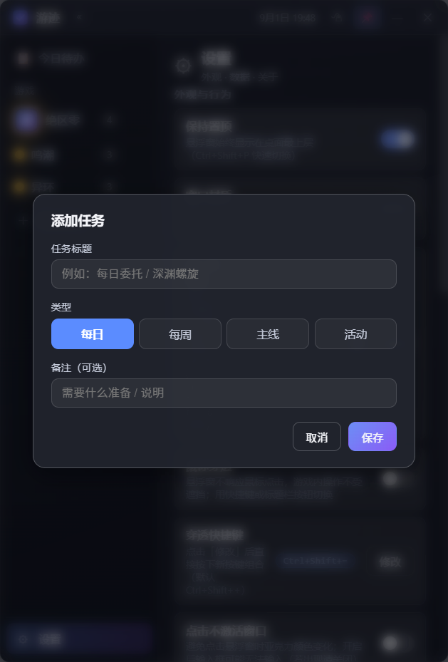
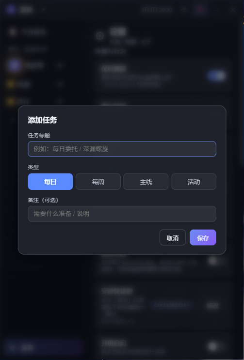

# GameRemainder

**[English](README.md) | [中文](README_CN.md)**

> **Your floating game-task tracker for PC** — track daily / weekly / main-story / event tasks across all your games in one always-on-top frosted-glass window, sorted by what expires first, so you never miss a daily reset or an expiring event again.

<p align="center">
  
  
  
  
</p>

---

## Introduction

GameRemainder (游迹) is a lightweight, **fully offline** desktop tracker for people playing several games at once. You add a game, fill in its tasks — dailies, weeklies, main story, limited-time events — and the app floats on top of your desktop as a small frosted-glass window. Each game is strictly isolated, daily/weekly tasks auto-reset at the times your game actually resets (e.g. 04:00), and the **Today** view ranks your games by the soonest expiring event, so you always see what you haven't done first.

Everything is stored in a local JSON file. No accounts, no cloud, no telemetry.

---

## Features

### Windows Desktop App · v1.0.0

| Feature | Description |
|---|---|
| **Always-on-top floating window** | Stays above other windows, including fullscreen games (periodic topmost re-assert); 📌 toggle / `Ctrl+Shift+P`; closes to the system tray and keeps running |
| **Frosted-glass look, stable color** | Transparent window + CSS `backdrop-filter` blur. Color is fully CSS-controlled — it does **not** change when you click inside or outside the window (system Acrylic was dropped for this reason) |
| **Multi-game isolation** | Games and their tasks never mix; drag items in the sidebar to reorder them; sidebar is collapsible and resizable |
| **Four task types, auto reset** | Daily / Weekly / Main / Event. Daily & weekly reset at each game's configured reset hour and day; main/event stay checked until you uncheck them |
| **Urgency-sorted Today view** | Across all games, the game with the **soonest expiring activity** is listed first; inside each game, order is Daily → Weekly → Event → Main, with events sorted by remaining days |
| **Due dates, two ways** | For events, either pick an exact date or just type "3" for 3 days from now |
| **Image icons only** | No emoji icons. Upload a local image as the game icon; games without an icon show a status dot (red/yellow/blue/green/gray = completion state) |
| **Mouse click-through** | Toggle so the window ignores clicks — your game keeps the mouse while the tracker stays visible. Global hotkey `Ctrl+Shift++` (configurable in Settings), titlebar button, or tray menu |
| **Window opacity** | 20%–100% in 1% steps, for less occlusion while gaming |
| **7-day history dots** | Daily tasks show whether they were done on each of the last 7 days |
| **Backgrounds & blur** | Per-game and global background images with adjustable blur |
| **Local JSON storage** | Atomic writes to `userData/data.json`; export / import full backups anytime |
| **Custom resize handles** | Frameless window — drag any edge or corner to resize |
| **Global shortcuts** | `Ctrl+Shift+P` pin, `Ctrl+Shift+H` show/hide, `Ctrl+Shift++` click-through |

---

## Screenshots

> Captured from the app itself (sample data).

| Today | Game view | Add task |
|---|---|---|
|  |  |  |

| Settings | Frosted glass on desktop |
|---|---|
|  |  |

---

## Getting Started

### Desktop App

**Requirements**

| Tool | Version |
|---|---|
| OS | Windows 10 / 11 |
| Node.js | 18 or newer (for building from source) |
| npm | Bundled with Node.js |

**Install dependencies**

```bash
npm install
```

> In mainland China, use a mirror for the Electron binary:

```bash
$env:ELECTRON_MIRROR="https://npmmirror.com/mirrors/electron/"
npm install
```

**Run in development**

```bash
npm start
```

**Verify**

```bash
npm test          # domain-model unit tests
npm run smoke     # Electron smoke self-check (auto-exits with pass/fail)
```

**Build the installer**

```bash
npm run pack        # → dist/游迹-安装版-1.0.0.exe (NSIS installer)
npm run pack:dir    # → dist/win-unpacked/ (unpacked directory, for testing)
```

> The build uses the locally installed Electron distribution (`electronDist`), so it works **offline** — no component download is needed.

**Install / run**

1. Run `dist/游迹-安装版-1.0.0.exe` and follow the setup wizard — choose an install directory, desktop shortcut is created.
2. First launch shows an empty dashboard; click **＋ 添加游戏** in the sidebar to start.
3. Close hides the window to the tray — use **托盘 → 退出** to fully quit.

> For public distribution, attach the installer exe to a [GitHub Release](https://docs.github.com/en/repositories/releasing-projects-on-github/managing-releases-in-a-repository) for one-click downloads.

---

## Usage Guide

### First-run setup

1. Click **＋ 添加游戏**, enter the game name and **upload a local image** as its icon (optional background image too).
2. Set the game's **daily reset time** (most games reset at 04:00) and **weekly reset day**.
3. Inside the game, click **＋ 添加任务** to add tasks. Pick the type: 每日 / 每周 / 主线 / 活动.
4. For an **event**, set the deadline in one of two ways — pick a date, or type the number of **remaining days**.

### Daily usage

- The **今日待办** view lists every unfinished task across all games. Games are ordered by their **soonest expiring activity**; within a game the order is 每日 → 每周 → 活动 → 主线, and events are sorted by remaining days.
- Click the circle to check off a task. Daily/weekly tasks flip back to "not done" automatically at the next reset; main/event tasks stay done until you uncheck them.
- The sidebar dot shows each game's completion state: red = nothing done, yellow = dailies left, blue = only weeklies left, green = all done, gray = no daily/weekly tasks.

### While gaming

- Press **`Ctrl+Shift++`** (or the 🖱 titlebar button) to make the window click-through — your mouse passes to the game while the tracker stays visible. Press again to restore. The hotkey is changeable in Settings → 穿透快捷键.
- Enable **鼠标穿透** is the standard way to keep the tracker over a game; adjust **窗口透明度** to taste.
- In fullscreen games the window keeps floating on top; if a game ever covers it, re-toggle 保持置顶 or use the tray.

### Shortcuts

| Shortcut | Action |
|---|---|
| `Ctrl+Shift+P` | Toggle always-on-top |
| `Ctrl+Shift+H` | Show / hide the main window |
| `Ctrl+Shift++` | Toggle mouse click-through |
| `Esc` | Close the current dialog |

### Data & backup

All data lives in one JSON file — open it from Settings → 本地存储 → 打开目录. Use **导出** / **导入** to back up or move your data. There is **no cloud sync**; uninstalling or deleting the file removes everything, so export a backup before reinstalling.

---

## Privacy and Security

- **100% offline** — the app makes no network requests. No accounts, no cloud, no ads, no analytics, no tracking SDKs.
- **All data stays on your machine** in a local JSON file (`%APPDATA%\游迹 · 游戏任务记录器\data.json`).
- **Backups are yours** — export produces a plain JSON you can inspect, version, or restore.
- **No permissions required** beyond what a desktop app normally uses (startup registration is optional and off by default).

---

## Disclaimer

This is an independent utility project. It is not affiliated with, endorsed by, or connected to any game company. All game names, item names and trademarks belong to their respective owners; game schedules (reset times, event deadlines) may change at any time — always verify in game. Screenshots in this README use sample data. This project is provided for communication and personal-use purposes only.

---

## License

Released under the **MIT License** — see [LICENSE](LICENSE).
