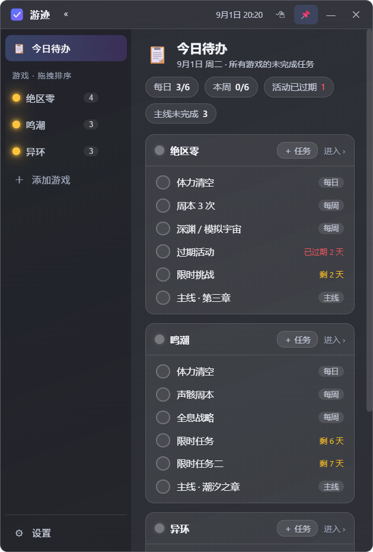
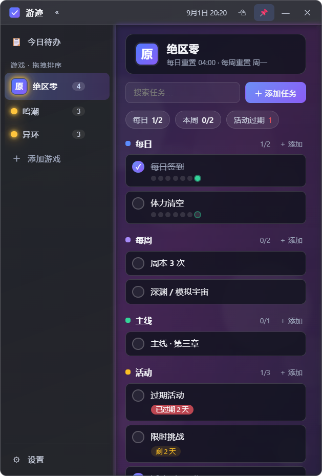
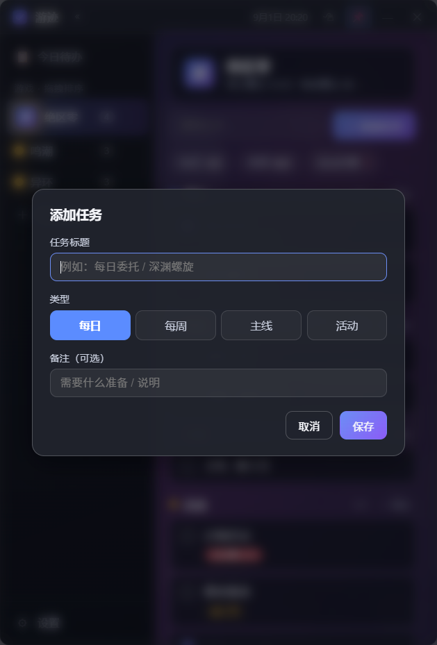

# 游迹 · 游戏任务记录器（GameRemainder）

> 面向 PC 的**悬浮置顶 + 透明毛玻璃**游戏任务记录器。
> 解决"游戏太多、记不清还有哪些没做"的痛点：每日 / 每周 / 主线 / 活动四类任务，多游戏严格隔离。



游戏视图与任务弹窗预览：

| 游戏视图 | 添加任务弹窗 |
| --- | --- |
|  |  |

---

## ✨ 功能一览

| 能力 | 说明 |
| --- | --- |
| 🪟 **悬浮置顶** | 窗口常驻桌面最上层；📌 按钮 / `Ctrl+Shift+P` 随时切换；关闭收进托盘常驻 |
| 🌫️ **透明毛玻璃** | 透明窗口 + CSS `backdrop-filter` 高斯模糊，颜色稳定（点击窗口内外均不变色） |
| 🎮 **多游戏隔离** | 每款游戏独立的任务与完成记录，互不可见 |
| 📅 **四类任务** | 每日（按游戏重置小时自动重置）/ 每周（按重置日）/ 主线（手动保持）/ 活动（截止倒计时、过期高亮） |
| ✅ **周期完成判定** | 每日任务显示"近 7 天完成点阵"；勾选按当前周期记录，跨周期自动归零 |
| 📋 **今日待办总览** | 一屏列出所有游戏的未完成每日/每周/临期活动/未完成主线，附完成度统计 |
| 💾 **本地数据** | JSON 原子写盘，自动保存；导出 / 导入备份；开机自启可选 |

## 🚀 快速开始

```bash
# 1. 安装依赖（首次）
npm install

# 2. 启动
npm start
```

> 提示：若安装 Electron 二进制较慢，可设置镜像后重装：
> ```bash
> $env:ELECTRON_MIRROR="https://npmmirror.com/mirrors/electron/"
> npm install
> ```

## 📦 打包发布（可选）

```bash
npm run pack:portable   # 生成便携版单文件 exe（dist/游迹-便携版-x.x.x.exe）
npm run pack:dir        # 生成免安装目录（dist/win-unpacked）
```

## ⌨️ 快捷键

| 快捷键 | 功能 |
| --- | --- |
| `Ctrl+Shift+P` | 切换窗口置顶（全局） |
| `Ctrl+Shift+H` | 显示 / 隐藏主窗口（全局） |
| `Ctrl+Shift++` | 鼠标穿透 开/关（全局，设置中可改） |
| `Esc` | 关闭当前弹窗 |

## 🗂️ 项目结构

```
GameRemainder/
├── main.cjs               # Electron 主进程：悬浮/毛玻璃/托盘/原子写盘/冒烟与截图模式
├── preload.cjs            # contextBridge 安全 IPC
├── renderer/
│   ├── index.html         # 页面骨架（自绘标题栏/侧栏/内容区）
│   ├── css/app.css        # 透明毛玻璃深色主题
│   └── js/
│       ├── model.js       # 领域模型（纯函数：周期键/到期/统计）→ 可单测
│       ├── store.js       # 状态层：CRUD + 防抖保存
│       ├── ui.js          # 视图渲染 + 弹窗 + 事件
│       └── main.js        # 入口 + 冒烟自检
├── docs/
│   ├── 01-需求分析.md      # 需求分析文档
│   ├── 02-系统设计.md      # 系统设计文档
│   └── screenshots/       # UI 截图验证
├── diagrams/              # 架构图（drawio + 渲染 PNG/SVG）
├── test/model.test.mjs    # 领域模型单元测试
├── scripts/gen-icon.mjs   # 纯 Node 生成应用图标
└── assets/                # 应用图标（icon.ico/png、tray.png）
```

## 🧪 测试与验证

```bash
npm test            # 领域模型单元测试（Node，74 项断言）
npm run smoke       # Electron 冒烟自检（16 项：DOM/模型/存储往返/渲染/隔离/交互）
npm run shots       # 自动截取 UI 截图到 docs/screenshots/
```

### 数据存储位置

- Windows：`%APPDATA%/game-remainder/data.json`（设置页可一键打开目录）
- 冒烟 / 截图模式使用临时目录，不触碰真实数据。

## 📝 使用建议

1. 添加游戏时设置好**每日重置时间**（多数游戏凌晨 4 点）与**每周重置日**；
2. 活动任务填写**截止日期**，临期会黄色提示、过期红色高亮；
3. 主线/活动任务可按需选择"每日重置 / 每周重置"，例如活动内的每日签到；
4. 建议开启**开机自启**，让悬浮窗随系统常驻。
